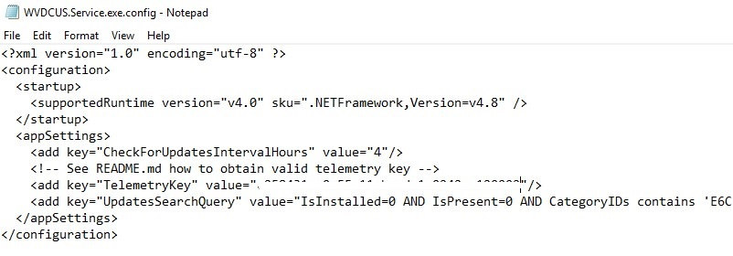
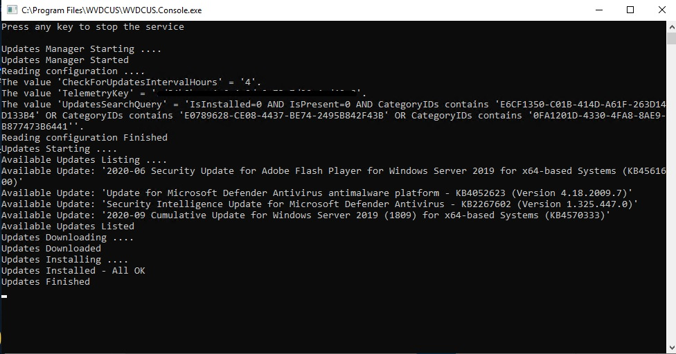
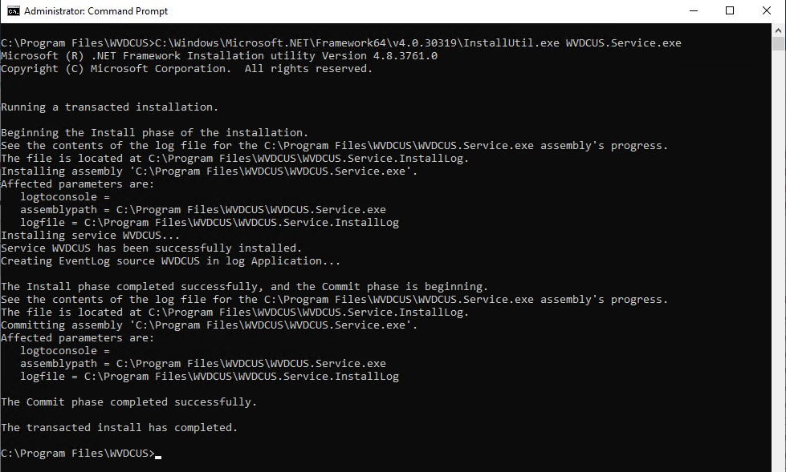
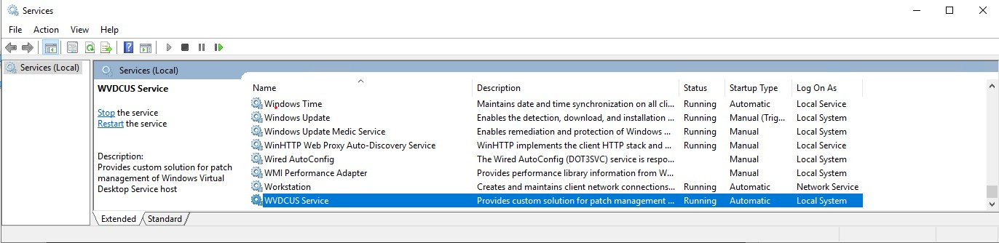
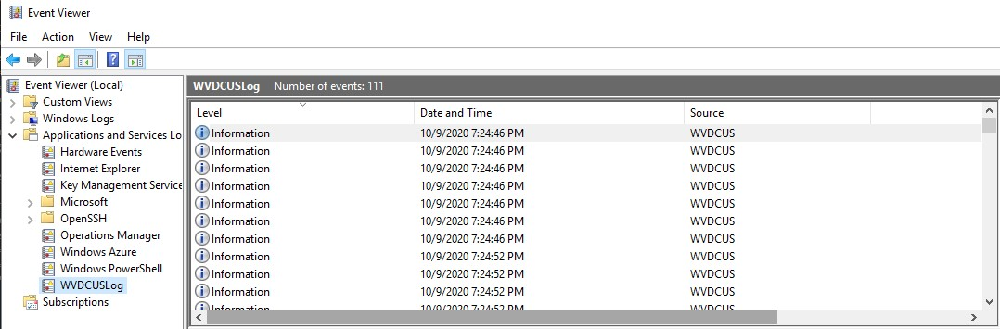

# Windows Custom Updates Solution

## Overview

This project is light weight patch management tool for Windows based OS.
It helps to monitor and control patch management of OS.
Originally written to help with patch management for Windows Virtual Desktop (WVD) based solutions
but works also very well for other - non WVD based solutions or setups. (E.g. patch management for family computers)

### When to use this project?

For patch management for Windows based workloads you have typically many enterprise level options.
For example System Center Configuration Manager, Windows Update for Business, Windows Update, in case of WVD patch management also injection into base WVD image.

But sometimes, maybe you do not have setup which allows you to use tools highlighted above.
Maybe you have many AD domains and forests, maybe you might be missing some capabilities like reporting, dashboards, telemetry to name few.

This is when you might benefit from this project which is trying to address such needs.

Generally, our recommendation is always to look first on professional solutions described above
and only if you see some gaps with those professional solutions you might want to check this open source project.

### Features

- Robust NT Service based tool, designed for Auto Recovery
- Automated updates installation, no manual interventions required
- Flexibility with updates configuration (E.g. you can specify which category of updates should be installed, maybe security patches only)
- Centralized place where telemetry data and states about monitored hosts and patch states is stored
- Powerful query language to analyze telemetry data in very fast way
- Rich Reporting capability based on powerful query language above
- Rich Alerting mechanism based on powerful query language above (E.g. send email when automatic update installation fails)
- This solution benefits from the Azure Cloud native components, providing serverless experience with high availability and redundancy, providing minimalist need for any maintenance (Configure once and forget)
- Configuration options how frequently should be online patches checked for availability and which category of patches should be downloaded and installed
- Windows Events Logs support
- Built on top of Windows Update Agent API
- Open source tool released under permissive free software MIT license. Anybody can benefit, anybody can contribute, no commercial restrictions.

## Prerequisites

- Components of this solution require .NET Framework runtime (not .NET Core) to be installed on monitored hosts.
For the time being it is version 4.8.
  - You can download the .NET Framework runtime here: <https://dotnet.microsoft.com/download/dotnet-framework>. Select Download .NET Framework Runtime. (not Developer Pack).
  - Information about .NET Framework runtime installation is here: <https://docs.microsoft.com/en-us/dotnet/framework/deployment/deployment-guide-for-developers>.
- You will need to have access to Azure Cloud and provision Log Analytics Workspace. You can verify the access in Azure Portal <https://portal.azure.com> and try to search and create the service `Application Insights` and `Log Analytics Workspace`. You can also create free Azure account if needed: <https://azure.microsoft.com/en-us/free>

## Installation

- Make sure all project prerequisites are met and installed
- Download the latest version of this project from the releases web page: <https://github.com/jbinko/Windows-Custom-Updates-Solution/releases>.
Following files are available in assets section:
  - `WVDCUS.zip` - contains binary files which needs to be deployed to monitored hosts
  - `Source code.zip` - Source code of this project
  - `Source code.tar.gz` - Source code of this project in different tar/zip format
- Download the file `WVDCUS.zip`. In the downloads directory right click `Properties` on the file and mark the checkbox `Unblock`. Click `OK`.
- Extract the content of the `WVDCUS.zip` file on all monitored hosts into the `WVDCUS` directory. For example into the directory: `C:\Program Files\WVDCUS`

## Provisioning of required Azure Cloud Services

- Go to the Azure Portal <https://portal.azure.com>. If you do not have Azure Cloud enabled yet, you can create free Azure account: <https://azure.microsoft.com/en-us/free>
- Create or use existing Resource Group in preferred region: <https://docs.microsoft.com/en-us/azure/azure-resource-manager/management/manage-resource-groups-portal#create-resource-groups>
- Into Resource Group create resource `Log Analytics Workspace` in preferred region, with unique name and pay-as-you-go plan: <https://docs.microsoft.com/en-us/azure/azure-monitor/learn/quick-create-workspace#create-a-workspace>
- Into Resource Group create workspace-based resource `Application Insights` into the same region as previous resource, with unique name, with workspace-based option and select the workspace you created before. <https://docs.microsoft.com/en-us/azure/azure-monitor/app/create-workspace-resource#create-workspace-based-resource>
- On the just created `Application Insights` resource click `Overview` and copy `Instrumentation Key` alias `Telemetry Key` which will be used later during configuration.

## Configuration

- Go to the directory where you extracted the binary files of this project. E.g. directory: `C:\Program Files\WVDCUS`
- Open the file `WVDCUS.Service.exe.config` in the notepad (or any other text editor)
- Search for the configuration value `TelemetryKey` and replace the content `00000000-0000-0000-0000-000000000000` with the value you obtained from the `Application Insights` resource from `Instrumentation Key` item.
- When needed, change the value of configuration key `CheckForUpdatesIntervalHours` to more suitable value. This value specifies how frequently check for new updates should be done. Default is 4 hours and valid value can be between 1 - 590 hours.
- When needed, change the value of the configuration key `UpdatesSearchQuery` to more suitable value. This value specifies which type and categories of patches should be installed automatically. Description of the query and parameters are here: <https://docs.microsoft.com/en-us/previous-versions/windows/desktop/ff357803(v=vs.85)> and here: <https://docs.microsoft.com/en-us/windows/win32/api/wuapi/nf-wuapi-iupdatesearcher-search>
- Save the file
- Repeat the same configuration for the file `WVDCUS.Console.exe.config`
- Save the file

### Test a Configuration with Console Application

- If you configured and provisioned mandatory settings, you can execute the Console Application `WVDCUS.Console.exe` now to see if the application is configured correctly. Watch for any errors in the application output. If you see some errors verify that you have enough permissions. Application might to check, download and install patches if they are available.
- Check that application works correctly (including patches installations) and press any key to stop the application

## Register Windows Service

Once you verified a configuration with the console application you can finalize configuration with registration of application to run as Windows service.
To register application to run as Windows service, you must have administrator credentials on the computer where it's installed.
You need to use `installutil.exe` tool, which is part of .NET runtime.
This tool is installed with the .NET Framework to the folder `%windir%\Microsoft.NET\Framework[64]\<framework version>`. For example, the default path for the 64-bit version is `%windir%\Microsoft.NET\Framework64\v4.0.30319\InstallUtil.exe`.

- Open Command Prompt with administrative credentials - `Run as Administrator`
- Change directory into directory where you extracted binary files. E.g. `cd C:\Program Files\WVDCUS`
- Execute registration process with command: `C:\Windows\Microsoft.NET\Framework64\v4.0.30319\InstallUtil.exe WVDCUS.Service.exe`
- If the service installs successfully, the command reports success. If the `installutil.exe` process fails, check the install log to find out why. By default, the log is in the same folder as the service executable.
- If you run console application `WVDCUS.Console.exe` before - then the `installutil.exe` will fail. The error is that Event Log is registered already by console application. If fails, just uninstall the Windows service with command bellow (removes Event Log) and install Windows service again.
- Uninstall command (parameter /u): `C:\Windows\Microsoft.NET\Framework64\v4.0.30319\InstallUtil.exe /u WVDCUS.Service.exe`
- Install command again: `C:\Windows\Microsoft.NET\Framework64\v4.0.30319\InstallUtil.exe WVDCUS.Service.exe`

### Verify Windows Service

- Run command: `services.msc` where you can find just registered Windows Service under the display name `WVDCUS Service`. The name of the service itself is `WVDCUS`.
- Open the service `WVDCUS Service`. On Recovery tab specify for First and Second failure `Restart the Service` action.
- Click `Apply`
- On General tab click button `Start`
- Service should remain in Started state.

### Verify health of Windows Service

You can see detailed information about health of service, failures, informational messages in an event log.

- Run command: `eventvwr.msc` where you can find detailed information in log files.
- In Event Viewer, expand Applications and Services Logs, search for `WVDCUSLog` log.
- Check information inside the log file to identify any potential issues

